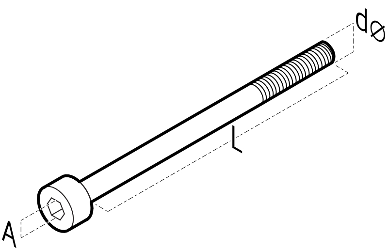

---
hide:
  - footer
---
# KAW-/KAF-/KAF
**필터 레귤레이터, 필터, 레귤레이터 (모듈러 타입)**

{style="width:700px"}

{==

:face_with_monocle:
본 설명서는 사용자 지침 및 제품 작동에 중요한 정보를 담고 있습니다.
 제품 사용전 반드시 읽어보시기 바랍니다.

==}

## 안전 지침 표시기호
본 문서에는 "주의", "경고" 그리고 "위험" 이라는 표시기호로 잠재적인 위험 수준을 나타내고 있습니다.

!!! danger "위험 - 주의하지 않으면 사망 또는 심각한 부상에 이르는 긴급한 위험"
!!! warning "경고 - 주의하지 않으면 사망 또는 심각한 부상으로 이어질 수 있는 위험"
!!! caution "주의 - 주의하지 않으면 가벼운 부상을 초래할 수 있는 위험"

## 안전 유의사항

### 안전 지침
* 제품 사용전 사용 설명서를 빠짐없이 읽고 안전수칙을 준수하십시오.
* 본 설명서를 향후 참조를 위해 안전한 장소에 보관하십시오.
* 제품을 임의로 개조 및 분해, 조립을 하지 마십시오.
* 제품의 라벨이나 사용자 메뉴얼에 명시된 사용 조건을 준수하십시오.
* 제품의 조작 및 설치, 분리는 주변 상태의 안전을 확인 후 실시하여 주십시오.
* 명기되지 않은 조건이나 환경에서의 사용은 안전 대책을 충분히 검토하여 주시고, 당사와의 상담을 권장 드립니다. 

### 전문 인력의 자격
* 제품에 대한 충분한 지식과 경험이 있으신 분의 취급을 권장합니다.
* 제품 사용용도의 적합성 여부는 시스템의 설계 또는 사양을 결정하는 분께서 판단하여 주십시오.

## 보증 및 면책사항
제품을 사용하실 때 아래와 같은 **"보증 및 면책사항"**을 적용합니다. 
 하기 내용을 확인하신 후 당사 제품을 사용해 주십시오.

* 표준 제품에 대한 보증기간은 사용 개시일로부터 1년 이내 또는 납품 후 18개월 이내 중 먼저 도래하는 시점의 것을 적용합니다.
* 보증기간 중 당사의 귀책으로 인한 고장이나 손상이 명확할 시에는 대체품/필요한 교환 부품을 제공하며, 추가적인 손실에 대해서는 부담하지 않습니다. 여기서의 보증은 당사 제품에 대한 보증을 의미하며 제품의 고장으로 유발된 여타 손상은 보증의 대상 범위에서 제외됩니다. 

## 제품사양

**KAW**

<table>
<thead>
<tr>
<th align="left">항목</th>
<th align="center">KAW101</th>
<th align="center">KAW201</th>
<th align="center">KAW301</th>
<th align="center">KAW401</th>
<th align="center">KAW601</th>
</tr>
</thead>
<tbody>
<tr>
<td align="left">관접속구경</td>
<td align="center">Rc(PT)1/8"</td>
<td align="center">Rc(PT)1/4"</td>
<td align="center">Rc(PT)3/8"</td>
<td align="center">Rc(PT)1/2"</td>
<td align="center">Rc(PT)1"</td>
</tr>
<tr>
<td align="left">압력계 접속구경</td>
<td align="center">Rc(PT)1/16"</td>
<td align="center">Rc(PT)1/8"</td>
<td align="center">Rc(PT)1/8"</td>
<td align="center">Rc(PT)1/4"</td>
<td align="center">Rc(PT)1/4"</td>
</tr>
<tr>
<td align="left">사용 유체</td>
<td align="center" colspan="5">여과된 압축 공기</td>
</tr>
<tr>
<td align="left">주변 및 사용유체 온도</td>
<td align="center" colspan="5">-5 ~ 60 ℃ (단, 결빙이 없어야 함)</td>
</tr>
<tr>
<td align="left">보증내 압력</td>
<td align="center" colspan="5">1.5 Mpa</td>
</tr>
<tr>
<td align="left">사용압력</td>
<td align="center" colspan="5">0.05 ~ 0.85 Mpa</td>
</tr>
<tr>
<td align="left">설정압력범위</td>
<td align="center" colspan="5">0.05 ~ 0.85 Mpa</td>
</tr>
<tr>
<td align="left">여과도</td>
<td align="center" colspan="5">표준: 5 μm, 옵션: 20 μm, 40 μm</td>
</tr>
<tr>
<td align="left">바울/바울가드 재질</td>
<td align="center" colspan="5">바울: 폴리카보네이트 / 바울가드: 나이론</td>
</tr>
<tr>
<td align="left">작동 방식</td>
<td align="center" colspan="5">표준: 릴리프타입 / 옵션: 체크밸브내장</td>
</tr>
<tr>
<td align="left">드레인 타입</td>
<td align="center" colspan="5">자동 드레인(차압식 / 플로트식)</td>
</tr>
<tr>
<td align="left">중량</td>
<td align="center">78g</td>
<td align="center">215g</td>
<td align="center">520g</td>
<td align="center">850g</td>
<td align="center">2,550g</td>
</tr>
</tbody>
</table>

<!-- KAW
| 항목                  |                       KAW101                        |   KAW201   |   KAW301   |   KAW401   | KAW601     |
| :-------------------- | :-------------------------------------------------: | :--------: | :--------: | :--------: | :---------: |
| 관접속구경            |                     Rc(PT)1/8"                      | Rc(PT)1/4" | Rc(PT)3/8" | Rc(PT)1/2" | Rc(PT)1"   |
| 압력계 접속구경       |                     Rc(PT)1/16"                     | Rc(PT)1/8" | Rc(PT)1/8" | Rc(PT)1/4" | Rc(PT)1/4" |
| 사용 유체             |            여과된 압축 공기  {colspan=5}            |            |            |            |            |
| 주변 및 사용유체 온도 |    -5 ~ 60 ℃ (단, 결빙이 없어야 함)  {colspan=5}    |            |            |            |            |
| 보증내 압력           |                1.5 Mpa  {colspan=5}                 |            |            |            |            |
| 사용압력              |             0.05 ~ 0.85 Mpa {colspan=5}             |            |            |            |            |
| 설정압력범위          |             0.05 ~ 0.85 Mpa {colspan=5}             |            |            |            |            |
| 여과도                |     표준: 5 μm, 옵션: 20 μm, 40 μm {colspan=5}      |            |            |            |            |
| 바울/바울가드 재질    | 바울: 폴리카보네이트 / 바울가드: 나이론 {colspan=5} |            |            |            |            |
| 작동 방식             | 표준: 릴리프타입 / 옵션: 체크밸브내장  {colspan=5}  |            |            |            |            |
| 드레인 타입           |     자동 드레인(차압식 / 플로트식)  {colspan=5}     |            |            |            |            |
| 중량                  |                         78g                         |    215g    |    520g    |    850g    | 2,550g     |
-->

<!-- KAR
| 항목                  |                       KAR101                       |   KAR201   |   KAR301   |   KAR401   |   KAR601   |
| :-------------------- | :------------------------------------------------: | :--------: | :--------: | :--------: | :--------: |
| 관접속구경            |                     Rc(PT)1/8"                     | Rc(PT)1/4" | Rc(PT)3/8" | Rc(PT)1/2" |  Rc(PT)1"  |
| 압력계 접속구경       |                    Rc(PT)1/16"                     | Rc(PT)1/8" | Rc(PT)1/8" | Rc(PT)1/4" | Rc(PT)1/4" |
| 사용 유체             |           여과된 압축 공기  {colspan=5}            |            |            |            |            |
| 주변 및 사용유체 온도 |   -5 ~ 60 ℃ (단, 결빙이 없어야 함)  {colspan=5}    |            |            |            |            |
| 보증내 압력           |                1.5 Mpa  {colspan=5}                |            |            |            |            |
| 사용압력              |            0.05 ~ 0.85 Mpa {colspan=5}             |            |            |            |            |
| 설정압력범위          |            0.05 ~ 0.85 Mpa {colspan=5}             |            |            |            |            |
| 작동 방식             | 표준: 릴리프타입 / 옵션: 체크밸브내장  {colspan=5} |            |            |            |            |
| 중량                  |                        67g                         |    185g    |    430g    |    690g    |   1,790g   |
-->

<!-- KAF 
| 항목                  |                       KAF101                        |   KAF201   |   KAF301   |   KAF401   |  KAF601  |
| :-------------------- | :-------------------------------------------------: | :--------: | :--------: | :--------: | :------: |
| 관접속구경            |                     Rc(PT)1/8"                      | Rc(PT)1/4" | Rc(PT)3/8" | Rc(PT)1/2" | Rc(PT)1" |
| 사용 유체             |            여과된 압축 공기  {colspan=5}            |            |            |            |          |
| 주변 및 사용유체 온도 |    -5 ~ 60 ℃ (단, 결빙이 없어야 함)  {colspan=5}    |            |            |            |          |
| 보증내 압력           |                1.5 Mpa  {colspan=5}                 |            |            |            |          |
| 사용압력              |             0.05 ~ 0.85 Mpa {colspan=5}             |            |            |            |          |
| 여과도                |     표준: 5 μm, 옵션: 20 μm, 40 μm {colspan=5}      |            |            |            |          |
| 바울/바울가드 재질    | 바울: 폴리카보네이트 / 바울가드: 나이론 {colspan=5} |            |            |            |          |
| 드레인 타입           |     자동 드레인(차압식 / 플로트식)  {colspan=5}     |            |            |            |          |
| 중량                  |                         70g                         |    140g    |    290g    |    470g    |  1,400g  |
-->

**KAR**
<table>
<thead>
<tr>
<th align="left">항목</th>
<th align="center">KAR101</th>
<th align="center">KAR201</th>
<th align="center">KAR301</th>
<th align="center">KAR401</th>
<th align="center">KAR601</th>
</tr>
</thead>
<tbody>
<tr>
<td align="left">관접속구경</td>
<td align="center">Rc(PT)1/8"</td>
<td align="center">Rc(PT)1/4"</td>
<td align="center">Rc(PT)3/8"</td>
<td align="center">Rc(PT)1/2"</td>
<td align="center">Rc(PT)1"</td>
</tr>
<tr>
<td align="left">압력계 접속구경</td>
<td align="center">Rc(PT)1/16"</td>
<td align="center">Rc(PT)1/8"</td>
<td align="center">Rc(PT)1/8"</td>
<td align="center">Rc(PT)1/4"</td>
<td align="center">Rc(PT)1/4"</td>
</tr>
<tr>
<td align="left">사용 유체</td>
<td align="center" colspan="5">여과된 압축 공기</td>
</tr>
<tr>
<td align="left">주변 및 사용유체 온도</td>
<td align="center" colspan="5">-5 ~ 60 ℃ (단, 결빙이 없어야 함)</td>
</tr>
<tr>
<td align="left">보증내 압력</td>
<td align="center" colspan="5">1.5 Mpa</td>
</tr>
<tr>
<td align="left">사용압력</td>
<td align="center" colspan="5">0.05 ~ 0.85 Mpa</td>
</tr>
<tr>
<td align="left">설정압력범위</td>
<td align="center" colspan="5">0.05 ~ 0.85 Mpa</td>
</tr>
<tr>
<td align="left">작동 방식</td>
<td align="center" colspan="5">표준: 릴리프타입 / 옵션: 체크밸브내장</td>
</tr>
<tr>
<td align="left">중량</td>
<td align="center">67g</td>
<td align="center">185g</td>
<td align="center">430g</td>
<td align="center">690g</td>
<td align="center">1,790g</td>
</tr>
</tbody>
</table>

**KAF**
<table>
<thead>
<tr>
<th align="left">항목</th>
<th align="center">KAF101</th>
<th align="center">KAF201</th>
<th align="center">KAF301</th>
<th align="center">KAF401</th>
<th align="center">KAF601</th>
</tr>
</thead>
<tbody>
<tr>
<td align="left">관접속구경</td>
<td align="center">Rc(PT)1/8"</td>
<td align="center">Rc(PT)1/4"</td>
<td align="center">Rc(PT)3/8"</td>
<td align="center">Rc(PT)1/2"</td>
<td align="center">Rc(PT)1"</td>
</tr>
<tr>
<td align="left">사용 유체</td>
<td align="center" colspan="5">여과된 압축 공기</td>
</tr>
<tr>
<td align="left">주변 및 사용유체 온도</td>
<td align="center" colspan="5">-5 ~ 60 ℃ (단, 결빙이 없어야 함)</td>
</tr>
<tr>
<td align="left">보증내 압력</td>
<td align="center" colspan="5">1.5 Mpa</td>
</tr>
<tr>
<td align="left">사용압력</td>
<td align="center" colspan="5">0.05 ~ 0.85 Mpa</td>
</tr>
<tr>
<td align="left">여과도</td>
<td align="center" colspan="5">표준: 5 μm, 옵션: 20 μm, 40 μm</td>
</tr>
<tr>
<td align="left">바울/바울가드 재질</td>
<td align="center" colspan="5">바울: 폴리카보네이트 / 바울가드: 나이론</td>
</tr>
<tr>
<td align="left">드레인 타입</td>
<td align="center" colspan="5">자동 드레인(차압식 / 플로트식)</td>
</tr>
<tr>
<td align="left">중량</td>
<td align="center">70g</td>
<td align="center">140g</td>
<td align="center">290g</td>
<td align="center">470g</td>
<td align="center">1,400g</td>
</tr>
</tbody>
</table>

## 제품 구성 및 조립도
{style="width:600px"}

## 모듈 조립방법
### 조립 유의사항
!!! danger "유체 공급방향에 유의하여 조립하여 주십시오. 순서 : 공급측 → 출력측"

* 모듈러 조립 기본순서 : 필터 → 레귤레이터 → 루브리케이터
* 다수의 필터 조립시 여과도가 큰 것에서 작은 순으로 조립합니다.
  

{style="width:600px"}

### 조립 방법
1. 조립할 제품 사이에 씰을 체결시킵니다.
 `101, 201, 301 몸체` - 좌측에 위치한 제품의 출구포트에 있는 씰 체결 홈에 씰을 체결시킵니다.
 `401, 601 몸체` - 씰+스페이서를 제품 사이에 체결시킵니다.

2. 양쪽 제품을 위치 시킨후 모듈 브라켓을  전, 후면 고정합니다.
3. 브라켓 고정 볼트를 브라켓의 전면에서 후면방향으로 조립합니다.  -	조임토크 : 

### 브라켓 고정볼트 부품규격

{style="width:200px"}

| 적용모델      | 모델 사이즈 | 육각렌치 사이즈(A) | 볼트 규격(dXL) | 고정볼트 부품코드 |
| :------------ | :---------- | :----------------- | :------------- | :---------------- |
| KAW, KAF, KAR | 201         | 2.5mm              | M3X40L         |                   |
| KAW, KAF, KAR | 301         | 3mm                | M4X45L         |                   |
| KAW, KAF, KAR | 401         | 4mm                | M5X50L         |                   |
| KAW, KAF, KAR | 601         | 5mm                | M6X70L         |                   |

## 설치 및 해체
### 설치 전 유의사항
!!! danger "가압상태의 제품은 인명피해와 물적 손해를 유발할 수 있습니다. 설치 작업 전, 반드시 제품과 배관 내부의 압력을 배출하여 주십시오."

* 유지보수나 안전한 조작을 위해 제품 주변의 여유공간을 마련해 주십시오.
* 습도 및 온도가 높은 장소에는 설치하지 말아 주십시오. 성능저하 또는 작동 불량의 원인이 됩니다.
* 배관전에 배관 등의 플러싱 혹은 세정을 충분히 실시하여 관 내의 이물질을 제거해 주십시오. 배관이나 피팅을 나사체결하는 경우에도 배관 나사의 절분이나 씰 재가 기기 내부에 유입되지 않도록 하여주십시오. 작동불량의 원인이 됩니다.

### 공압배관
1. 유량의 방향을 확인하여 제품을 위치 시킵니다.
 제품 몸체에 IN 과 OUT 또는 화살표시를 확인하십시오.
2. 공압포트에 배관이나 피팅의 나사부를 체결합니다. 
  -	암나사측을 잡고 적정 토크로 실시해 주십시오. 
   체결토크가 부족하면 느슨해지거나 제대로 씰링되지 않을 수 있으며, 체결토크가 지나치면 나사 파손 등의 원인이 됩니다.
3. 공압포트를 완전히 밀봉 후 공압 튜브를 연결합니다.

### 드레인 배관
* 드레인 배출구가 아래방향으로 되도록 수직으로 설치하십시오.
 횡방향이나 위방향으로는 사용할 수 없습니다.

* 오토드레인 배출 배관의 경우, 오토드레인 키트(AD201F, AD301N, AD401N)는 외경 ∅6(내경 ∅4) 튜브를 사용하며 길이는 5m 이내로 해주십시오.

### 해체
!!! danger "해체 작업 전, 반드시 제품과 배관 내부의 압력을 배출하여 주십시오."
1. 시스템 전체와 제품에서 공기를 배출하십시오.
2. 배관이나 피팅에서 잠금장치를 눌러서 푼 다음 호스 라인을 당겨 빼내십시오.
3. 피팅을 연결 플랜지에서 푼 다음 돌려 꺼내십시오.

## 레귤레이터의 압력 조정
### 압력 조정 전 유의사항
### 압력 조정 방법

## 유지 보수
### 공기원
### 보수점검
### 드레인 배출
### 필터 교체
### 청소

## 고장과 대책
