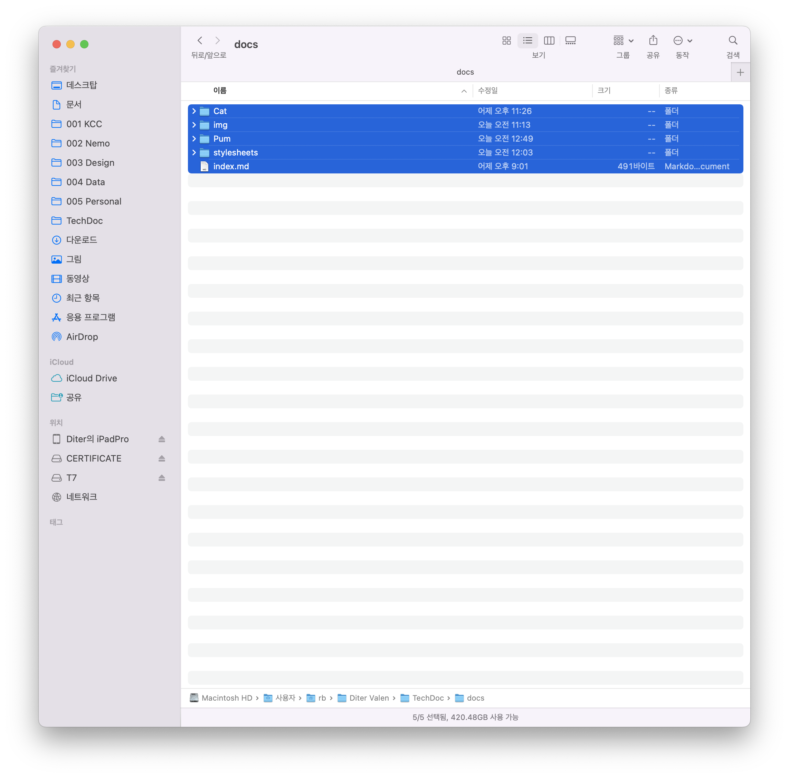

---
hide:
  - footer
---
# KAW-/KAF-/KAF
**필터 레귤레이터, 레귤레이터, 필터 (모듈러 타입)**

{style="width:500px"}

Text can be {--deleted--} and replacement text {++added++}. This can also be
combined into {~~one~>a single~~} operation. {==Highlighting==} is also
possible {>>and comments can be added inline<<}.

{==

:face_with_monocle:
본 설명서는 사용자 지침 및 제품 작동에 중요한 정보를 담고 있습니다.
 제품 사용전 반드시 읽어보시기 바랍니다.

==}

## 안전 지침 표시기호
본 문서에는 "주의", "경고" 그리고 "위험" 이라는 표시기호로 잠재적인 위험 수준을 나타내고 있습니다.

!!! danger "위험 - 주의하지 않으면 사망 또는 심각한 부상에 이르는 긴급한 위험"
!!! warning "경고 - 주의하지 않으면 사망 또는 심각한 부상으로 이어질 수 있는 위험"
!!! caution "주의 - 주의하지 않으면 가벼운 부상을 초래할 수 있는 위험"

## 안전 유의사항

### 안전 지침
* 제품 사용전 사용 설명서를 빠짐없이 읽고 안전수칙을 준수하십시오.
* 본 설명서를 향후 참조를 위해 안전한 장소에 보관하십시오.
* 제품을 임의로 개조 및 분해, 조립을 하지 마십시오.
* 제품의 라벨이나 사용자 메뉴얼에 명시된 사용 조건을 준수하십시오.
* 제품의 조작 및 설치, 분리는 주변 상태의 안전을 확인 후 실시하여 주십시오.
* 명기되지 않은 조건이나 환경에서의 사용은 안전 대책을 충분히 검토하여 주시고, 당사와의 상담을 권장 드립니다. 

### 전문 인력의 자격
* 제품에 대한 충분한 지식과 경험이 있으신 분의 취급을 권장합니다.
* 제품 사용용도의 적합성 여부는 시스템의 설계 또는 사양을 결정하는 분께서 판단하여 주십시오.

## 보증 및 면책사항
* 표준 제품에 대한 보증기간은 사용 개시일로부터 1년 이내 또는 납품 후 18개월 이내 중 먼저 도래하는 시점의 것을 적용합니다.
* 보증기간 중 당사의 귀책으로 인한 고장이나 손상이 명확할 시에는 대체품/필요한 교환 부품을 제공하며, 추가적인 손실에 대해서는 부담하지 않습니다. 여기서의 보증은 당사 제품에 대한 보증을 의미하며 제품의 고장으로 유발된 여타 손상은 보증의 대상 범위에서 제외됩니다. 

## 제품사양
| 항목            |               | KAW101                                                             | KAW201 | KAW301 | KAE401 | KAW601 |
| --------------- | ------------: | ------------------------------------------------------------------ | ------ | ------ | ------ | ------ |
| 관 접속구경     | 표준 옵션 | Rc(PT)1/4" Rc(PT)1/8", G 1/4", NPT1/4"                         |        |        |        |        |
|                 |               | :material-check:     Fetch resource   { colspan=5 }                |        |        |        |        |
| 압력계 접속구경 |               | :material-check-all: Update resource                               |        |        |        |        |
| 사용유체        |               | :material-close:     Delete resourceDelete resourceDelete resource |        |        |        |        |

- ==This was marked==
- ^^This was inserted^^
- ~~This was deleted~~

## 제품 구성 및 조립도

<table>
<thead>
<tr>
<th>항목</th>
<th align="right"></th>
<th>KAW101</th>
<th>KAW201</th>
<th>KAW301</th>
<th>KAE401</th>
<th>KAW601</th>
</tr>
</thead>
<tbody>
<tr>
<td>관 접속구경</td>
<td align="right">표준 옵션</td>
<td>Rc(PT)1/4" Rc(PT)1/8", G 1/4", NPT1/4"</td>
<td></td>
<td></td>
<td></td>
<td></td>
</tr>
<tr>
<td></td>
<td align="right"></td>
<td colspan="5"><svg xmlns="http://www.w3.org/2000/svg" viewBox="0 0 24 24"><path d="M21 7 9 19l-5.5-5.5 1.41-1.41L9 16.17 19.59 5.59 21 7Z"></path></svg>     Fetch resource</td>
</tr>
<tr>
<td>압력계 접속구경</td>
<td align="right"></td>
<td><svg xmlns="http://www.w3.org/2000/svg" viewBox="0 0 24 24"><path d="M.41 13.41 6 19l1.41-1.42L1.83 12m20.41-6.42L11.66 16.17 7.5 12l-1.43 1.41L11.66 19l12-12M18 7l-1.41-1.42-6.35 6.35 1.42 1.41L18 7Z"></path></svg> Update resource</td>
<td></td>
<td></td>
<td></td>
<td></td>
</tr>
<tr>
<td>사용유체</td>
<td align="right"></td>
<td><svg xmlns="http://www.w3.org/2000/svg" viewBox="0 0 24 24"><path d="M19 6.41 17.59 5 12 10.59 6.41 5 5 6.41 10.59 12 5 17.59 6.41 19 12 13.41 17.59 19 19 17.59 13.41 12 19 6.41Z"></path></svg>     Delete resourceDelete resourceDelete resource</td>
<td></td>
<td></td>
<td></td>
<td></td>
</tr>
</tbody>
</table>